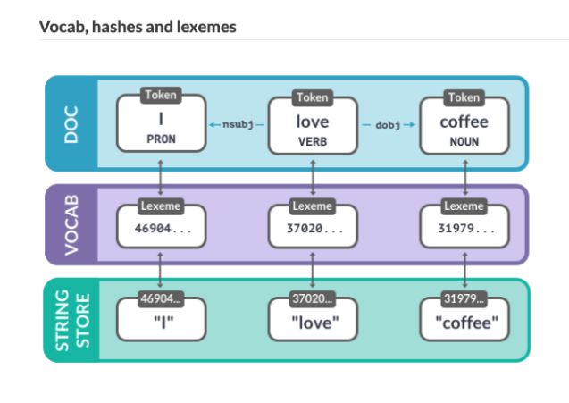

---
jupyter:
  jupytext:
    formats: ipynb,md
    text_representation:
      extension: .md
      format_name: markdown
      format_version: '1.2'
      jupytext_version: 1.4.2
  kernelspec:
    display_name: spacy
    language: python
    name: spacy
---

# 2: Large-scale data analysis with spaCy


Extract specific information from large volumes of text.
Use spaCy's data structures,
and combine statistical with rule-based
approaches for text analysis.


## Data structures: `Vocab`, `Lexemes` and `StringStore`


### Shared vocab and string store

- `Vocab` stores data shared across multiple documents
- spaCy encodes strings to hash values
- Strings are only stored once in `StringStore` via `nlp.vocab.strings`
- String store serves as a lookup table in both directions

  ```python
  coffee_hash = nlp.vocab.strings["coffee"]
  coffee_string = nlp.vocab.string[coffee_hash]
  ```

- Hashes can't be reversed—
  which is why we need to provide a the shared vocab
  
  ```python
  # Raises an error if we haven't seen the string before
  string = nlp.vocab.strings[3197928453018144401]
  ```

- Look up the strings and hash in `nlp.vocab.strings`

```python
from spacy.lang.en import English

nlp = English()

doc = nlp("I love coffee")
print("hash value:", nlp.vocab.strings["coffee"])
print("string value:", nlp.vocab.strings[3197928453018144401])
```

- The `doc` also exposes vocab and strings

```python
doc = nlp("I love coffee")
print("hash value:", doc.vocab.strings["coffee"])
```

### Lexemes: entries in the vocabulary

- A `Lexeme` object
  is an entry in the vocabulary

```python
doc = nlp("I love coffee")
lexeme = nlp.vocab["coffee"]

# Print the lexical attributes
print(lexeme.text, lexeme.orth, lexeme.is_alpha)
```

It contains _context-independent_ information about a word.

- **Word text:** `lexeme.text` and `lexeme.orth` (the hash)
- **Lexical attributes** `lexeme.is_alpha`
- Not context-dependent part-of-speech tags, dependencies or entity labels.


### Vocab, hashes, and lexemes




## Strings to hashes

Look up the string `"cat"`
in `nlp.vocab.strings`
to get the hash.
Look up the hash
to get back the string.

- **`nlp.vocal.strings`**
  access vocab words

```python
from spacy.lang.en import English

nlp = English()
doc = nlp("I have a cat")

# Look up the hash for the word "cat"
cat_hash = nlp.vocab.strings["cat"]
print(cat_hash)

# Look upt he cat_hash to get the string
cat_string = nlp.vocab.strings[cat_hash]
print(cat_string)
```

Look up the string label `"PERSON"`
in `nlp.vocab.strings`
to get the hash.
Look up the hash to get back the string.

```python
from spacy.lang.en import English

nlp = English()
doc = nlp("David Bowiee is a PERSON")

# Look up the hash for the word "PERSON"
person_hash = nlp.vocab.strings["PERSON"]
print(person_hash)

# Look upt he person_hash to get the string
person_string = nlp.vocab.strings[person_hash]
print(person_string)
```

<!-- #region -->
## Vocab, hashes, and lexemes

Why does this throw an error?

```python
from spacy.lang.en import English
from spacy.lang.de import German

# Create an English and German nlp object
nlp = English()
nlp_de = German()

# Get the ID for the string 'Bowie'
bowie_id = nlp.vocab.strings["Bowie"]
print(bowie_id)

# Look up the ID for "Bowie" in the vocab
print(nlp_de.vocab.strings[bowie_id])
```

**Answer:**
The string `"Bowie"` isn’t in the German vocab,
so the hash can’t be resolved in the string store.
<!-- #endregion -->

## Data structures: `Doc`, `Span`, and `Token`

<!-- #region -->
### `Doc`

```python
# Create an nlp object
from spacy.lang.en import English
nlp = English()

# Import the Doc class
from spacy.tokens import Doc

# The words and spaces to create the doc from
words = ["Hello", "world", "!"]
spaces = [True, False, False]

# Create a doc manually
doc = Doc(nlp.vocab, words=words, spaces=spaces)
```
<!-- #endregion -->

<!-- #region -->
### `Span`

```python
# Import the Doc and Span classes
from spacy.tokens import Doc, Span

# The words and spaces to create the doc from
words = ["Hello", "world", "!"]
spaces = [True, False, False]

# Create a doc manually
doc = Doc(nlp.vocab, words=words, spaces=spaces)

# Create a span manually
span = Span(doc, 0, 2)

# Create a span with a label
span_with_label = Span(doc, 0, 2, label="GREETING")

# Add span to the doc.ents
doc.ents = [span_with_label]
```
<!-- #endregion -->

### Best practices

`Doc` and `Span`
hold references and relationships
of words and sentences.

- Convert result to strings
  as late as possible.
- Use token attributes if available—
  such as `token.i` for the index
- Pass in the shared `vocab`


## Creating a `Doc`

- **`Doc`**
  Construct using vocab, words, and spaces.

```python
from spacy.lang.en import English

nlp = English()

# Import the Doc class
from spacy.tokens import Doc

# Desired text: "spaCy is cool!"
words = ["spaCy", "is", "cool", "!"]
spaces = [True, True, False, False]

# Create a Doc from the words and spaces
doc = Doc(nlp.vocab, words=words, spaces=spaces)
print(doc.text)
```

```python
from spacy.lang.en import English

nlp = English()

# Import the Doc class
from spacy.tokens import Doc

# Desired text: "Go, get started!"
words = ["Go", ",", "get", "started", "!"]
spaces = [False, True, True, False, False]

# Create a Doc from the words and spaces
doc = Doc(nlp.vocab, words=words, spaces=spaces)
print(doc.text)
```

```python
from spacy.lang.en import English

nlp = English()

# Import the Doc class
from spacy.tokens import Doc

# Desired text: "Oh, really?!"
words = ["Oh", ",", "really", "?", "!"]
spaces = [False, True, False, False, False]

# Create a Doc from the words and spaces
doc = Doc(nlp.vocab, words=words, spaces=spaces)
print(doc.text)
```

## Docs, spans, and entities from scratch

Create the `Doc` and `Span` object manually,
and update the name entities.
This echoes what spaCy does
behind the scenes.

- **`Span`**
  Create using doc, position, and label
- **`doc.ents`**
  Access and overwrite document entities

```python
from spacy.lang.en import English

nlp = English()

# Import the Doc and Span classes
from spacy.tokens import Doc, Span

words = ["I", "like", "David", "Bowie"]
spaces = [True, True, True, False]

# Create a doc from the words and spaces
doc = Doc(nlp.vocab, words=words, spaces=spaces)
print(doc.text)

# Create a span for "David Bowie" from the doc and assign it to the label "Person"
span = Span(doc, 2, 4, label="PERSON")
print(span.text, span.label_)

# Add the span to the doc's entities
doc.ents = [span]

# Print entities' text and labels
print([(ent.text, ent.label_) for ent in doc.ents])
```

<!-- #region -->
## Data structures and best practices

The code in this example
is trying to analyze a text
and collect all proper nouns
that are followed by a verb.

```python
import spacy

nlp = spacy.load("en_core_web_sm")
doc = nlp("Berlin is a nice city")

# Get all tokens and part-of-speech tags
token_texts = [token.text for token in doc]
pos_tags = [token.pos_ for token in doc]

for index, pos in enumerate(pos_tags):
    # Check if the current token is a proper noun
    if pos == "PROPN":
        # Check if the next token is a verb
        if pos_tags[index + 1] == "VERB":
            result = token_texts[index]
            print("Found proper noun before a verb:", result)
```

The code is bad because
it only uses lists of stings
instead of native token attributes.
This is less efficient.


Rewrite the code using native token attributes
instead of lists of `token_texts` and `pos_tags`.
<!-- #endregion -->

```python
import spacy

nlp = spacy.load("en_core_web_sm")
doc = nlp("Berlin is a nice city")

for token in doc:
    # Check if the current token is a proper noun
    if token.pos_ == "PROPN":
        # Check if the next token is a verb
        if doc[token.i + 1].pos_ == "VERB":
            result = token.text
            print("Found proper noun before a verb:", result)
```

## Word vectors and semantic similarity


### Comparing semantic similarity

spaCy can compare two objects
to predict similarity.
`Docs.similarity`, `Span.similarity()`, and `Token.similarity()`.
Requires a model that has word vectors included,
such as `en_core_web_md` (medium) or `en_core_web_lg` (large).
Will _not_ work with `en_core_web_sm` (small).

```python
import spacy

# Load a larger model with vectors
nlp = spacy.load("en_core_web_md")

# Compare two documents
doc1 = nlp("I like fast food")
doc2 = nlp("I like pizza")
print(doc1.similarity(doc2))
```

```python
# Compare two tokens
doc = nlp("I like pizza and pasta")
token1 = doc[2]
token2 = doc[4]
print(token1.similarity(token2))
```

```python
# Compare a document with a token
doc = nlp("I like pizza")
token = nlp("soap")[0]

print(doc.similarity(token))
```

```python
# Compare a span with a document

span = nlp("I like pizza and pasta")[2:5]
doc = nlp("McDonalds sells burgers")

print(span.similarity(doc))
```

### How spaCy predicts similarities

- Similarity determined via word vectors
- Multi-dimensional representation of words
- By default uses cosine similarity
- `Doc` and `Span` vectors default to average of token vectors
- Short phrases are better than long documents with irrelevant words


### Word vectors in spaCy

```python
# Load a larger model with vectors
nlp = spacy.load("en_core_web_md")

doc = nlp("I lave a banana")
# Access the vector via the token.vector attribute
print(doc[3].vector)
```

### Similarity depends on the application context

- Useful for recommendation systems, flagging duplicates, etc

```python
doc1 = nlp("I like cats")
doc2 = nlp("I hate cats")

print(doc1.similarity(doc2))
```

## Inspecting word vectors

- Need medium or large model, not small
- **`token.vector`**
  access vector representation

```python
import spacy

# Load the en_core_web_md model
nlp = spacy.load("en_core_web_md")

# Process a text
doc = nlp("Two bananas in pyjamas")

# Get the vector for the token "bananas"
bananas_vector = doc[1].vector
print(bananas_vector)
```

## Comparing similarities

- **`.similarity`**
  compare `Doc`, `Token`, and `Span`

```python
import spacy

nlp = spacy.load("en_core_web_md")

doc1 = nlp("It's a warm summer day")
doc2 = nlp("It's sunny outside")

# Get the similarity of doc1 and doc2
similarity = doc1.similarity(doc2)
print(similarity)
```

```python
import spacy

nlp = spacy.load("en_core_web_md")

doc = nlp("TV and books")
token1, token2 = doc[0], doc[2]

# Get the similarity of the tokens "TV" and "books"
similarity = token1.similarity(token2)
print(similarity)
```

```python
import spacy

nlp = spacy.load("en_core_web_md")

doc = nlp("This was a great restaurant. Afterwards, we went to a really nice bar.")

# Create spans for "great restaurant" and "really nice bar"
span1 = doc[3:5]
span2 = doc[12:15]

# Get the similarity of the spans
similarity = span1.similarity(span2)
print(similarity)
```

## Combining models and rules


### Statistical prediction vs rules

|                     | Statistical models                                          | Rule-based systems                                     |
| ------------------- | ----------------------------------------------------------- | ------------------------------------------------------ |
| Use cases           | application needs to generalize based on examples           | dictionary with finite number of examples              |
| Real-world examples | product names, person names, subject/object relationships   | countries of the world, cities, drug names, dog breeds |
| spaCy features      | entity recognizer, dependency parser, part-of-speech tagger | tokenizer, Matcher, PhraseMatcher                      |


<!-- #region -->
### Recap: rule-based matching

```python
# Initialize with the shared vocab
from spacy.matcher import Matcher
matcher = Matcher(nlp.vocab)

# Patterns are lists of dictionaries describing the tokens
pattern = [{"LEMMA": "love", "POS": "VERB"}, {"LOWER": "cats"}]
matcher.add("LOVE_CATS", None, pattern)

# Operators can specify how often a token should be matched
pattern = [{"TEXT": "very", "OP": "+"}, {"TEXT": "happy"}]
matcher.add("VERY_HAPPY", None, pattern)

# Calling matcher on doc returns list of (match_id, start, end) tuples
doc = nlp("I love cats and I'm very very happy")
matches = matcher(doc)
```
<!-- #endregion -->

### Adding statistical predictions

```python
from spacy.matcher import Matcher

matcher = Matcher(nlp.vocab)
matcher.add("DOG", None, [{"LOWER": "golden"}, {"LOWER": "retriever"}])
doc = nlp("I have a Golden Retriever")

for match_id, start, end in matcher(doc):
    span = doc[start:end]
    print("Matched span:", span.text)
    # Get the span's root token and root head token
    print("Root token:", span.root.text)
    print("Root head token:", span.root.head.text)
    # Get the previous token and its POS tag

    print("Previous token:", doc[start - 1].text, doc[start - 1].pos_)
```

## Efficient phrase matching

`PhraseMatcher`
like regular expression or keyword search,
but with access to tokens.
Takes `Doc` as parameter.
Faster than `Matcher`.
Great for matching large word lists.

```python
from spacy.matcher import PhraseMatcher

matcher = PhraseMatcher(nlp.vocab)

pattern = nlp("Golden Retriever")
matcher.add("DOG", None, pattern)
doc = nlp("I have a Golden Retriever")

# Iterate over the matches
for match_id, start, end in matcher(doc):
    # Get the matched span
    span = doc[start:end]
    print("Matched span:", span.text)
```

<!-- #region -->
## Debugging patterns

```python
pattern = [{"LOWER": "silicon"}, {"TEXT": " "}, {"LOWER": "valley"}]
doc = nlp("Can Silicon Valley workers rein in big tech from within?")
```

This pattern
does _not_ match the tokens in `doc`
because the tokenizer does not create tokens for single spaces.


Below,
match all case-insensitive mentions of `"Amazon"`,
plus a title-cased proper noun.
Additionally,
match all case-insensitive mentions of `"ad-free"`,
plus the following noun.
<!-- #endregion -->

```python
import spacy
from spacy.matcher import Matcher

nlp = spacy.load("en_core_web_sm")
doc = nlp(
    "Twitch Prime, the perks program for Amazon Prime members offering free "
    "loot, games and other benefits, is ditching one of its best features: "
    "ad-free viewing. According to an email sent out to Amazon Prime members "
    "today, ad-free viewing will no longer be included as a part of Twitch "
    "Prime for new members, beginning on September 14. However, members with "
    "existing annual subscriptions will be able to continue to enjoy ad-free "
    "viewing until their subscription comes up for renewal. Those with "
    "monthly subscriptions will have access to ad-free viewing until October 15."
)

# Create the match patterns
pattern1 = [{"LOWER": "amazon"}, {"IS_TITLE": True, "POS": "PROPN"}]
pattern2 = [{"LOWER": "ad"}, {"TEXT": "-"}, {"LOWER": "free"}, {"POS": "NOUN"}]

# Initialize the Matcher and add the patterns
matcher = Matcher(nlp.vocab)
matcher.add("PATTERN1", None, pattern1)
matcher.add("PATTERN2", None, pattern2)

# Iterate over the matches
for match_id, start, end in matcher(doc):
    # Print pattern string name and text of matched span
    print(doc.vocab.strings[match_id], doc[start:end].text)
```

<!-- #region -->
## Efficient phrase matching

Sometimes it's more efficient
to match exact strings
instead of writing patterns
describing individual tokens.

This is especially true for finite categories—
like countries of the world.

Pretend we have
all countries of the world in `exercises/en/countries.json`

```python
import json
from spacy.lang.en import English

with open("exercises/en/countries.json") as f:
    COUNTRIES = json.loads(f.read())

nlp = English()
doc = nlp("Czech Republic may help Slovakia protect its airspace")

# Import the PhraseMatcher and initialize it
from spacy.matcher import PhraseMatcher

matcher = PhraseMatcher(nlp.vocab)

# Create pattern Doc objects and add them to the matcher
# This is the faster version of: [nlp(country) for country in COUNTRIES]
patterns = list(nlp.pipe(COUNTRIES))
matcher.add("COUNTRY", None, *patterns)

# Call the matcher on the test document and print the result
matches = matcher(doc)
print([doc[start:end] for match_id, start, end in matches])
```
<!-- #endregion -->

<!-- #region -->
## Extracting countries and relationships

Use country matcher for longer text,
analyze the syntax,
and update the document's entities with the matched countries.

`"GPE"` label represents a geopolitical entity

```python
import spacy
from spacy.matcher import PhraseMatcher
from spacy.tokens import Span
import json

with open("exercises/en/countries.json") as f:
    COUNTRIES = json.loads(f.read())
with open("exercises/en/country_text.txt") as f:
    TEXT = f.read()

nlp = spacy.load("en_core_web_sm")
matcher = PhraseMatcher(nlp.vocab)
patterns = list(nlp.pipe(COUNTRIES))
matcher.add("COUNTRY", None, *patterns)

# Create a doc and reset existing entities
doc = nlp(TEXT)
doc.ents = []

# Iterate over the matches
for match_id, start, end in matcher(doc):
    # Create a Span with the label for "GPE"
    span = Span(doc, start, end, label="GPE")

    # Overwrite the doc.ents and add the span
    doc.ents = list(doc.ents) + [span]

    # Get the span's root head token
    span_root_head = span.root.head
    # Print the text of the span root's head token and the span text
    print(span_root_head.text, "-->", span.text)

# Print the entities in the document
print([(ent.text, ent.label_) for ent in doc.ents if ent.label_ == "GPE"])
```
<!-- #endregion -->

```python

```
