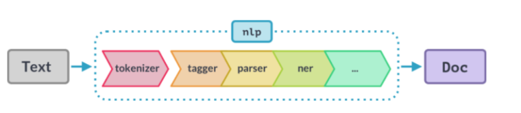

---
jupyter:
  jupytext:
    formats: ipynb,md
    text_representation:
      extension: .md
      format_name: markdown
      format_version: '1.2'
      jupytext_version: 1.4.2
  kernelspec:
    display_name: spacy
    language: python
    name: spacy
---

# 3: Processing pipelines

Notes and examples
on spaCy's processing pipelines.
Covers what goes on under the hood
when you process text,
how to write your own components
and add them to the pipeline,
and how to use custom attributes
to add your own metadata to documents, spans and tokens.


## Processing pipelines


### Built-in pipeline components

| Name    | Description             | Creates                                           |
| ------- | ----------------------- | ------------------------------------------------- |
| tagger  | Part-of-speech tagger   | Token.tag, Token.pos                              |
| parser  | Dependency parser       | Token.dep, Token.head, Doc.sents, Doc.noun_chunks |
| ner     | Named entity recognizer | Doc.ents, Token.ent_iob, Token.ent_type           |
| textcat | Text classifier         | Doc.cats                                          |


### Under the hood

Pipeline is defined in model's `meta.json`.
Built-in components need binary data to make predictions.


### Pipeline attributes

- **`nlp.pipe_names`**
  list of pipeline component names
- **`nlp.pipeline`**
  list of `(name, component)` tuples

```python
import spacy

nlp = spacy.load("en_core_web_sm")
print(nlp.pipe_names)
print(nlp.pipeline)
```

<!-- #region -->
## What happens when you call nlp?

When a user calls

```python
doc = nlp("This is a sentence")
```

spaCy tokenizes the text
and applies each pipeline component in order.
<!-- #endregion -->

## Inspecting the pipeline

Inspect the small English model's pipeline

- **`nlp.pipe_names`**
  list of pipeline component names
- **`nlp.pipeline`**
  list of `(name, component)` tuples

```python
import spacy

# Load the en_core_web_sm model
nlp = spacy.load("en_core_web_sm")

# Print the names of the pipeline components
print(nlp.pipe_names)

# Print the full pipeline of (name, component) tuples
print(nlp.pipeline)
```

## Custom pipeline components


### Why custom components?

Can make a function automatically execute
when `nlp` is called.
Can add custom metadata to documents and tokens.
Can update built-in attributes such as `doc.ents`

<!-- #region -->
### Anatomy of a component

Function that takes a `doc`,
modifies it,
and returns it.
Can be added using `nlp.add_pipe`

```python
def custom_component(doc):
    # Do something to the doc here
    return doc
nlp.add_pipe(custom_component)
```

| Argument | Description          | Example                                 |
| -------- | -------------------- | --------------------------------------- |
| last     | If True, add last    | nlp.add_pipe(component, last=True)      |
| first    | If True, add first   | nlp.add_pipe(component, first=True)     |
| before   | Add before component | nlp.add_pipe(component, before="ner")   |
| after    | Add after component  | nlp.add_pipe(component, after="tagger") |

<!-- #endregion -->

### Example: a simple component

```python
# Create the nlp object
nlp = spacy.load("en_core_web_sm")

# Define a custom component
def custom_component(doc):
    # Print the doc's length
    print("Doc length:", len(doc))
    # Return the doc object
    return doc


# Add the component first in the pipeline
nlp.add_pipe(custom_component, first=True)

# Print the pipeline component names
print("Pipeline:", nlp.pipe_names)
```

```python
# Create the nlp object
nlp = spacy.load("en_core_web_sm")

# Define a custom component
def custom_component(doc):

    # Print the doc's length
    print("Doc length:", len(doc))

    # Return the doc object
    return doc


# Add the component first in the pipeline
nlp.add_pipe(custom_component, first=True)

# Process a text
doc = nlp("Hello world!")
```

## Use cases for custom components

Custom components can be used to

- Compute your own values based on tokens and their attributes
- Add named entities,
  such as dictionary based ones


## Simple components

A simple component
that prints the length of a document.

- **`nlp.add_pipe`**
  add custom component to pipeline

```python
import spacy

# Define a custom component
def length_component(doc):
    # Get the doc's length
    doc_length = len(doc)
    print(f"This document is {doc_length} tokens long.")
    # Return the doc
    return doc

# Load the small English model
nlp = spacy.load("en_core_web_sm")

# Add the component first in the pipeline and print the pipe names
nlp.add_pipe(length_component, first=True)
print(nlp.pipe_names)

# Process a text
doc = nlp("This is a sentence.")
```

## Complex components

Create a custom component
that uses `PhraseMatcher`
to find animal names
in the document,
and adds the matched spans to `doc.ents`.

Add it _after_ the `ner` component.

```python
import spacy
from spacy.matcher import PhraseMatcher
from spacy.tokens import Span

nlp = spacy.load("en_core_web_sm")
animals = ["Golden Retriever", "cat", "turtle", "Rattus norvegicus"]
animal_patterns = list(nlp.pipe(animals))
print("animal_patterns:", animal_patterns)
matcher = PhraseMatcher(nlp.vocab)
matcher.add("ANIMAL", None, *animal_patterns)

# Define the custom component
def animal_component(doc):
    # Apply the matcher to the doc
    matches = matcher(doc)
    # Create a Span for each match and assign the label "ANIMAL"
    spans = [Span(doc, start, end, label="ANIMAL") for match_id, start, end in matches]
    # Overwrite the doc.ents with the matched spans
    doc.ents = spans
    return doc


# Add the component to the pipeline after the "ner" component
nlp.add_pipe(animal_component, after="ner")
print(nlp.pipe_names)

# Process the text and print the text and label for the doc.ents
doc = nlp("I have a cat and a Golden Retriever")
print([(ent.text, ent.label_) for ent in doc.ents])
```

## Extension attributes

<!-- #region -->
### Setting custom attributes

Add custom metadata
to documents, tokens, and spans
through `._` property.

```python
doc._.title = "My document"
token._.is_color = True
span._.has_color = False
```

Registered on the global `Doc`, `Token`, or `Span` using `set_extension`

```python
# Import global classes
from spacy.tokens import Doc, Token, Span

# Set extensions on the Doc, Token and Span
Doc.set_extension("title", default=None)
Token.set_extension("is_color", default=False)
Span.set_extension("has_color", default=False)
```

### Extension attribute types

1. Attribute
2. Property
3. Method

### Attribute extension

Default value that can be overwritten

```python
from spacy.tokens import Token

# Set extension on the Token with default value
Token.set_extension("is_color", default=False)

doc = nlp("The sky is blue.")

# Overwrite extension attribute value
doc[3]._.is_color = True
```

### Property extension

Define a getter optional setter function.
Getter only called when attribute value is retrieved.
<!-- #endregion -->

```python
from spacy.lang.en import English
from spacy.tokens import Token

nlp = English()

# Define getter function
def get_is_color(token):
    colors = ["red", "yellow", "blue"]
    return token.text in colors


# Set extension on the Token with getter
Token.set_extension("is_color", getter=get_is_color)

doc = nlp("The sky is blue.")
print(doc[3]._.is_color, "-", doc[3].text)
```

`Span` extensions should almost always use a getter

```python
from spacy.tokens import Span

# Define a getter function
def get_has_color(span):
    colors = ["red", "yellow", "blue"]
    return any(token.text in colors for token in span)


# Set extensions on the Span with getter
Span.set_extension("has_color", getter=get_has_color)

doc = nlp("The sky is blue.")
print(doc[1:4]._.has_color, "-", doc[1:4].text)
print(doc[0:2]._.has_color, "-", doc[0:2].text)
```

### Method extensions

Assign a function
that becomes available
as an object method.
Lets you pass arguments
to the extension function.

```python
from spacy.tokens import Doc

# Define method with arguments
def has_token(doc, token_text):
    in_doc = token_text in [token.text for token in doc]
    return in_doc


# Set extension on the Doc with method
Doc.set_extension("has_token", method=has_token)

doc = nlp("The sky is blue.")
print(doc._.has_token("blue"), "- blue")
print(doc._.has_token("cloud"), "- cloud")
```

## Setting extension attributes

- **`Token.set_extension`**
  register extension.
  Use `default` argument to set default.
  Use `getter` to pass in function.

```python
from spacy.lang.en import English
from spacy.tokens import Token

nlp = English()

# Register the Token extension attribute "is_country" with the default value ``False``
Token.set_extension("is_country", default=False)

# Process the text and set the is_country attribute to True for the token "Spain"
doc = nlp("I live in Spain.")
doc[-2]._.is_country = True

# Print the token text and the ``is_country`` attribute for all tokens
print([(token.text, token._.is_country) for token in doc])
```

```python
from spacy.lang.en import English
from spacy.tokens import Token

nlp = English()

# Define the getter function that takes a token and returns its reversed text
def get_reversed(token):
    return token.text[::-1]

# Register the Token property extension "reversed" with the getter ``get_reversed``
Token.set_extension("reversed", getter=get_reversed)

# Process the text and print the reversed attribute for each token
doc = nlp("All generalizations are false, including this one.")
for token in doc:
    print("reversed:", token._.reversed)
```

- **`Docs.set_extension`**
  define extension on `Docs`

```python
from spacy.lang.en import English
from spacy.tokens import Doc

nlp = English()

# Define the getter function
def get_has_number(doc):
    # Return if any of the tokens in the doc return True for ``token.like_num``.
    return any(token.like_num for token in doc)


# Register the Doc property extension ``has_nubmer`` with the getter ``get_has_number``
Doc.set_extension("has_number", getter=get_has_number)

# Process the text and check the custom ``has_number`` attribute
doc = nlp("The museum closed for five years in 2012.")
print("has_number:", doc._.has_number)
```

- **`Span.set_extension`**
  define extensions on `Span`
  `method` argument may be used
  to pass parameter with function

```python
from spacy.lang.en import English
from spacy.tokens import Span

nlp = English()

# Define the method
def to_html(span, tag):
    # Wrap the span text in an HTML tag and return it
    return f"<{tag}>{span.text}</{tag}>"

# Register the ``Span`` method extension ``to_html`` with the method ``to_html``
Span.set_extension("to_html", method=to_html)

# Process the text and call the ``to_html`` method on the span with the tag "strong"
doc = nlp("Hello world, this is a sentence.")
span = doc[0:2]
print(span._.to_html("strong"))
```

## Entities and extensions

Return a Wikipedia search URL
if the span is a person, organization, or location.

```python
import spacy
from spacy.tokens import Span

nlp = spacy.load("en_core_web_sm")


def get_wikipedia_url(span):
    # Get a Wikipedia URL if the span has one of the labels
    if span.label_ in ("PERSON", "ORG", "GPE", "LOCATION"):
        entity_text = span.text.replace(" ", "_")
        return "https://en.wikipedia.org/w/index.php?search=" + entity_text


# Set the Span extension wikipedia_url using getter ``get_wikipedia_url``
Span.set_extension("wikipedia_url", getter=get_wikipedia_url)

doc = nlp(
    "In over fifty years from his very first recordings right through to his "
    "last album, David Bowie was at the vanguard of contemporary culture."
)
for ent in doc.ents:
    # Print the text and Wikipedia URL of the entity
    print(ent.text, ent._.wikipedia_url)
```

<!-- #region -->
## Components with extensions

Extension attributes become powerful
when coupled with custom pipeline components.

This is a pipeline component that finds country names
and a custom attribute that returns a country's capital,
if available.

Assume there exists a file `exercises/en/countries.json`
that lists all countries.

```python
import json

from spacy.lang.en import English
from spacy.tokens import Span
from spacy.matcher import PhraseMatcher

with open("exercises/en/countries.json") as f:
    COUNTRIES = json.loads(f.read())

with open("exercises/en/capitals.json") as f:
    CAPITALS = json.loads(f.read())
    
nlp = English()
matcher = PhraseMatcher(nlp.vocab)
matcher.add("COUNTRY", None, *list(nlp.pipe(COUNTRIES)))


def countries_component(doc):
    # Create an entity Span with the label "GPE" for all matches
    matches = matcher(doc)
    doc.ents = [Span(doc, start, end, label="GPE") for match_id, start, end in matches]
    return doc


# Add the component to the pipeline
nlp.add_pipe(countries_component)
print(nlp.pipe_names)

# Getter that looks up the span text in the dictionary of country capitals
get_capital = lambda span: CAPITALS.get(span.text)

# Register the Span extension attribute "capital" with the getter ``get_capital``
Span.set_extension("capital", getter=get_capital)

# Process the text and print with entity text, label, and capital attributes
doc = nlp("Czech Republic may help Slovakia protect its airspace")
print([(ent.text, ent.label_, ent._.capital) for ent in doc.ents])
```

```text
['countries_component']
[('Czech Republic', 'GPE', 'Prague'), ('Slovakia', 'GPE', 'Bratislava')]
```
<!-- #endregion -->

<!-- #region -->
## Scaling performance

### Processing large volumes of text

Use `nlp.pipe`.
Process text as streams yielding `Doc`.
Faster than calling `nlp` on each.

```python
# Bad
docs = [nlp(text) for text in LOTS_OF_TEXTS]

# Good
docs = list(nlp.pipe(LOTS_OF_TEXTS))
```

### Passing in context

Use `as_tuples=True` on `nlp.pipe` to pass in `(text, context)` tuples.
This yields `(doc, context)` tuples.
<!-- #endregion -->

```python
from spacy.lang.en import English

nlp = English()

data = [
    ("This is a text", {"id": 1, "page_number": 15}),
    ("And another text", {"id": 2, "page_number": 16}),
]

for doc, context in nlp.pipe(data, as_tuples=True):
    print(doc.text, context["page_number"])
```

```python
from spacy.tokens import Doc

Doc.set_extension("id", default=None)
Doc.set_extension("page_number", default=None)

data = [
    ("This is a text", {"id": 1, "page_number": 15}),
    ("And another text", {"id": 2, "page_number": 16}),
]

for doc, context in nlp.pipe(data, as_tuples=True):
    doc._.id = context["id"]
    doc._.page_number = context["page_number"]
```

<!-- #region -->
### Using only the tokenizer



Don't run the whole pipeline
if you don't have to.
Use `nlp.make_doc`
to turn a text into a `Doc` object.

```python
# Bad
doc = nlp("Hello world")

# Good
doc = nlp.make_doc("Hello world!)
```

### Disabling pipeline components

`nlp.disable_pipes`
to temporarily disable on or more pipes.

```python
# Disable tagger and parser
with nlp.disable_pipes("tagger", "parser"):
    # Process the text and print entities
    doc = nlp(text)
    print(doc.ents)
```

`with` block restores them.
This only runs the remaining components.
<!-- #endregion -->

<!-- #region -->
## Processing streams

Iterate over the doc objects yielded by `nlp.pipe`
instead of of iterating over texts and processing them.

```python
import json

import spacy
from spacy.lang.en import English

nlp = English()

with open("exercises/en/tweets.json") as f:
    TEXTS = json.loads(f.read())

# Process the texts and print the adjectives
# Bad
# for text in TEXTS:
#     doc = nlp(text)
#     print([token.text for token in doc if token.pos_ == "ADJ"])

# Good
print(*[[token.text for token in doc if token.pos_ == "ADJ"] for doc in nlp.pipe(TEXTS)])
```

```text
['favorite']
['sick']
[]
['happy']
['delicious', 'fast']
[]
['terrible']
```

```python
import json

import spacy

nlp = spacy.load("en_core_web_sm")

with open("exercises/en/tweets.json") as f:
    TEXTS = json.loads(f.read())

# Process the texts and print the entities
# Bad
# docs = [nlp(text) for text in TEXTS]
# entities = [doc.ents for doc in docs]
# print(*entities)

# Good
print(*(doc.ents for doc in nlp.pipe(TEXTS)))
```

```text
(McDonalds,) () (McDonalds,) (McDonalds, Spain) (The Arch Deluxe,) () (This morning, gettin mcdonalds)
```
<!-- #endregion -->

```python
from spacy.lang.en import English

nlp = English()

people = ["David Bowie", "Angela Merkel", "Lady Gaga"]

# Create a list of patterns for the PhraseMatcher
# Bad
patterns = [nlp(person) for person in people]

# Good
# patterns = [person for person in nlp.pipe(people)]
```

```python
patterns[0].text
```

```python
from spacy.lang.en import English

nlp = English()

people = ["David Bowie", "Angela Merkel", "Lady Gaga"]

# Create a list of patterns for the PhraseMatcher
# Bad
# patterns = [nlp(person) for person in people]

# Good
patterns = list(nlp.pipe(people))
```

<!-- #region -->
## Processing data with context

Use custom attributes
to add author and book meta information quotes.

```python
import json
from spacy.lang.en import English
from spacy.tokens import Doc

with open("exercises/en/bookquotes.json") as f:
    DATA = json.loads(f.read())

nlp = English()

# Register the Doc extension "author" (default None)
Doc.set_extension("author", default=None)

# Register the Doc extension "book" (default None)
Doc.set_extension("book", default=None)

for doc, context in nlp.pipe(DATA, as_tuples=True):
    # Set the doc._.book and doc._.author attributes from the context
    doc._.book = context["book"]
    doc._.author = context["author"]

    # Print the text and custom attribute data
    print(f"{doc.text}\n — '{doc._.book}' by {doc._.author}\n")
```
<!-- #endregion -->

## Selective processing

- **`nlp.make_doc`**
  to only run tokenize step
- **`nlp.disable_pipes`**
  to skip preprocessing steps

```python
import spacy

nlp = spacy.load("en_core_web_sm")
text = (
    "Chick-fil-A is an American fast food restaurant chain headquartered in "
    "the city of College Park, Georgia, specializing in chicken sandwiches."
)

# Only tokenize the text
# doc = nlp(text)
doc = nlp.make_doc(text)
print([token.text for token in doc])
```

Disable the tagger and parser

```python
import spacy

nlp = spacy.load("en_core_web_sm")
text = (
    "Chick-fil-A is an American fast food restaurant chain headquartered in "
    "the city of College Park, Georgia, specializing in chicken sandwiches."
)

# Disable the tagger and parser
with nlp.disable_pipes("tagger", "parser"):
    # Process the text
    doc = nlp(text)
    # Print the entities in the doc
    print(doc.ents)
```

```python

```

```python

```

```python

```

```python

```
